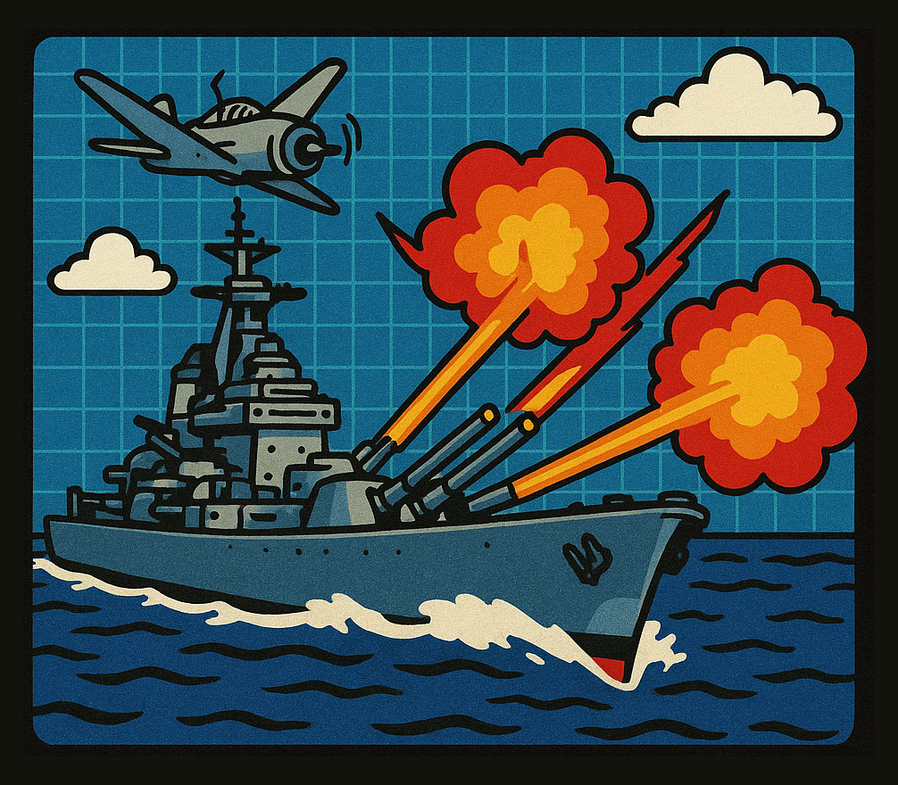

# BattleShips


Jeu de bataille navale "améliorée" en Python utilisant le moteur pyxel



| 😱 ChatGPT... 😭

## Avancement


- [x] Paramètres de jeu
- [x] Placement des bateaux - Joueur
- [ ] Placement des bateaux - Ordinateur
- [ ] Tour du joueur
- [ ] Tour de l'ordinateur
- [ ] Règles de bases
- [ ] Règles améliorées
- [ ] Fin du jeu
- [ ] Multi-joueurs LAN

## Lancement du jeu

1.  Installer [pyxel](https://github.com/kitao/pyxel/blob/main/docs/README.fr.md#comment-installer)

2.  Lancer la commande :

    ```
    python -m pyxel run main.py
    ```

## Ecrans

### Lancement d'une partie


### Placement des navires

