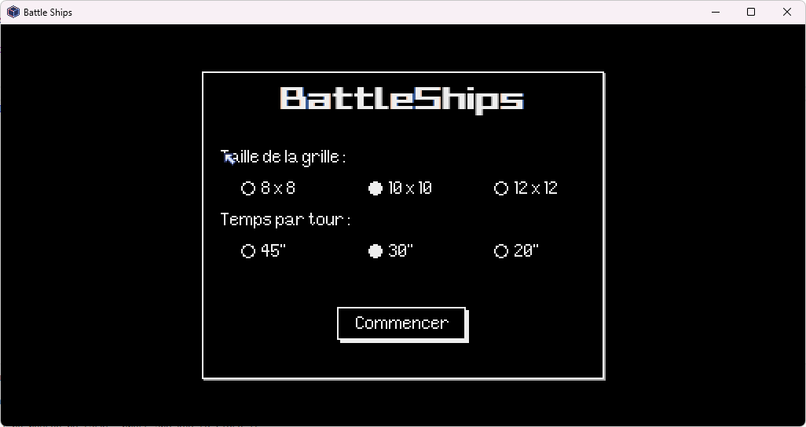
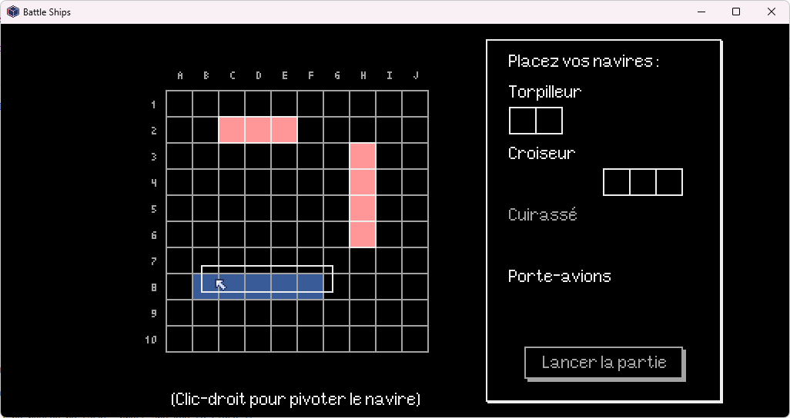

# BattleShips

Jeu de bataille navale "améliorée" en Python utilisant le moteur pyxel

## Lancement du jeu

1.  Installer [pyxel](https://github.com/kitao/pyxel/blob/main/docs/README.fr.md#comment-installer)

2.  Lancer la commande :

    ```
    python -m pyxel run main.py
    ```

## Ecrans

### Lancement d'une partie



### Placement des navires

